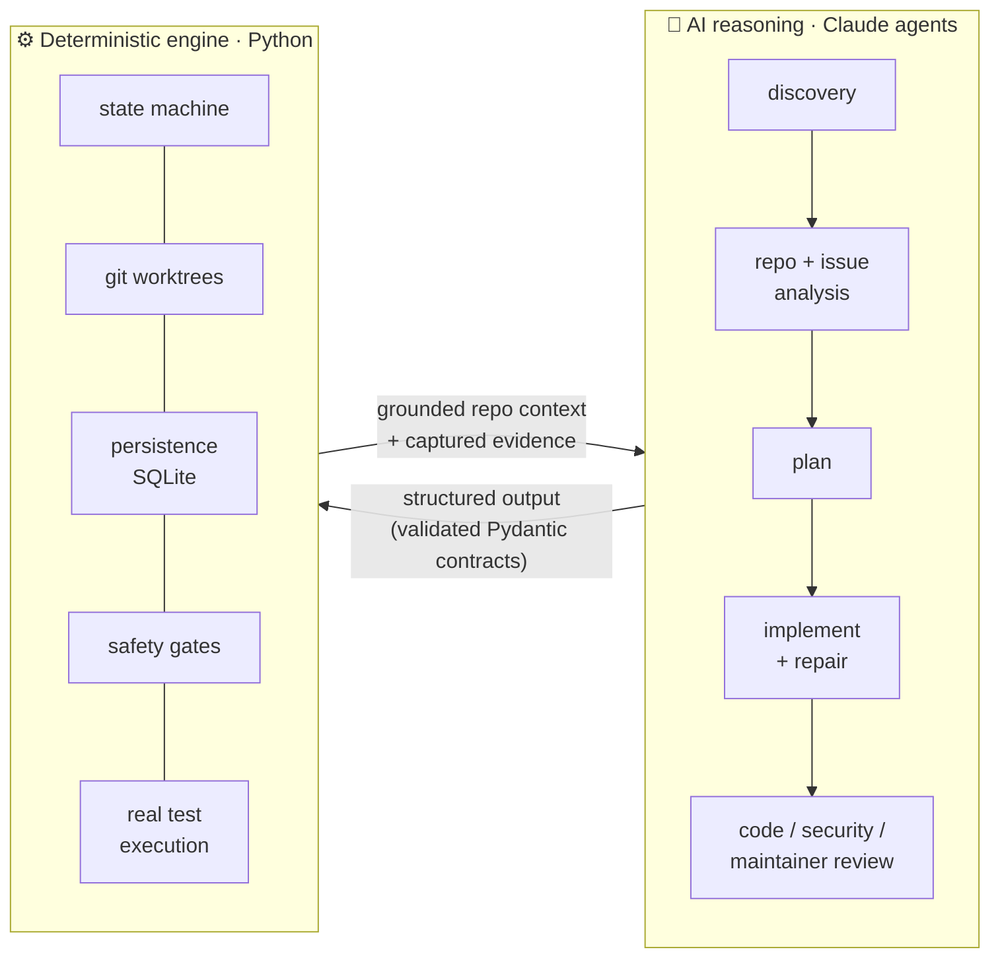
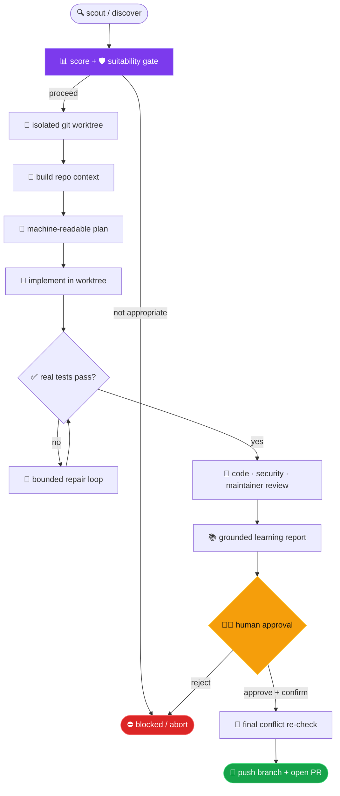

<div align="center">

# 🤖 OSS-Agent

### Human-in-the-loop AI agent that finds, understands, fixes, and prepares *real* open-source contributions — and refuses to spam maintainers.

[](https://www.python.org/)
[](LICENSE)
[](REFACTOR_PROGRESS.md)
[](REFACTOR_PROGRESS.md)
[](https://claude.com/claude-code)
[](#-what-oss-agent-does-not-do)
[-success)](https://github.com/ros-navigation/navigation2/pull/6445)

**[🎮 Live interactive demo](https://maharshi-coding.github.io/oss-agent/)** · **[🏆 A merged contribution](https://github.com/ros-navigation/navigation2/pull/6445)** · **[📚 Docs](docs/architecture.md)** · **[🧭 Engineering log](REFACTOR_PROGRESS.md)**

</div>

---

OSS-Agent separates **AI reasoning** (agents that understand repos, plan, implement, and review) from a **deterministic Python engine** that owns state, persistence, git, execution, safety, scoring, and observability. If a piece of logic can be tested without an LLM, it lives in Python — not in a prompt. Publishing is **never** automatic: nothing is pushed without an explicit human approval, a `submit` confirmation, and a final conflict re-check.

## 🎬 See it run

The workflow is watchable. OSS-Agent renders any live workflow as a pixel-art **"GitHub war room"** — nine agents at glowing laptops working one pull request, a wall screen showing the current stage, an evidence panel per agent, and a real event stream. Click an agent to inspect the exact evidence it captured; hit **▶ play run** to replay the pipeline.

> **▶ [Open the live demo →](https://maharshi-coding.github.io/oss-agent/)**
> *Rendered from a real end-to-end run on an owned sandbox repo (issue #3 → PR #4) where the fix was generated by the live Claude backend and validated by real `pytest`. This is actual persisted workflow data — not fake timed animation. (Or run `oss-agent visualize <id>` on any of your own workflows.)*

## 🏆 Proven in the wild

OSS-Agent is not a toy — it has been driven end-to-end against real repositories, and its output has been reviewed and **merged by maintainers**:

| Contribution | Repository | Status | Proof |
| --- | --- | --- | --- |
| Fix `BtActionNode` cancellation when halted before goal ack | **Nav2** (ROS 2 Navigation, ⭐ 4.7k) | ✅ **Merged** | [PR #6445](https://github.com/ros-navigation/navigation2/pull/6445) |
| Fix use-after-free in `servo_keyboard_input` demo | **MoveIt2** | 🟢 Open | [PR #3850](https://github.com/moveit/moveit2/pull/3850) |
| Full pipeline w/ live Claude backend → real PR | owned sandbox | ✅ Validated | end-to-end (private) |

> Contributions are **human-in-the-loop**: OSS-Agent prepares, explains, and gates them; a human approves; a maintainer reviews and merges. That is the whole point — see *[What OSS-Agent does **not** do](#-what-oss-agent-does-not-do)*.

## 🧠 How it works

AI does the *thinking*; deterministic Python does everything *sensitive*. The model never touches git, state, or the network directly.



## 🔄 The workflow

Every stage is a validated transition in a real state machine. Two hard gates protect maintainers: the **suitability gate** (before any code is written) and the **human-approval gate** (before anything is published).



## ✨ What it does

Given a developer profile, OSS-Agent will:

1. **Discover** candidate repositories/issues that match your profile.
2. **Analyze** the repository (build system, tests, CI, conventions, CONTRIBUTING) and the issue (problem, acceptance criteria, risks, ambiguity).
3. **Score** the opportunity (0–100) using configurable weights + your skill match.
4. **Assess suitability** — whether a contribution *should* be made here at all (existing/linked PRs, assignment, maintainer intent, staleness). The guard against becoming a PR-spam machine.
5. **Build a repository-context slice** (likely files, related tests, located symbols) from the checked-out code, then **plan** a minimal, in-scope change.
6. **Implement** it inside an isolated git worktree, with a bounded **repair loop** (every attempt persisted, inspectable via `oss-agent attempts`).
7. **Test** with the repository's real commands and capture the evidence (from exit codes — never inferred).
8. **Review** the diff independently: code review, security review (incl. prompt-injection), and a strict maintainer simulation.
9. **Explain & teach** — a grounded **learning report** so you can defend the change to a maintainer *before* submitting.
10. **Prepare** a pull request separately from **submitting** it: nothing is pushed without explicit `approve`, a confirmation, and a final conflict re-check.

## 🚀 Quickstart

```bash
# 1. install
python -m venv .venv
# Windows: .venv\Scripts\activate   ·   macOS/Linux: source .venv/bin/activate
pip install -e ".[dev]"

# 2. scaffold config + runtime dirs
oss-agent init

# 3. run fully offline (no network, no real GitHub) against seeded demo data
export OSS_AGENT_GITHUB_BACKEND=mock OSS_AGENT_AGENT_BACKEND=mock
oss-agent discover
oss-agent score octo-org/stringutils 101      # 0–100 with a full breakdown
oss-agent suitability octo-org/stringutils 101 # should you even contribute here?

# 4. watch it — open the pixel-art war room in your browser
oss-agent visualize
```

Switch `OSS_AGENT_GITHUB_BACKEND=gh` (uses the authenticated [`gh` CLI](https://cli.github.com/)) and `OSS_AGENT_AGENT_BACKEND=claude` (uses the authenticated Claude Code CLI) to run against live GitHub with the real model. The full test suite always uses the deterministic `mock` runner — no network, no credentials.

<details>
<summary><b>🕹️ Full CLI reference (30 commands)</b></summary>

| Command | Purpose |
| --- | --- |
| `oss-agent init` | scaffold config + runtime dirs |
| `oss-agent discover [--query]` | discover candidate issues |
| `oss-agent analyze <repo>` | repository report |
| `oss-agent analyze-issue <repo> <n>` | issue analysis |
| `oss-agent score <repo> <n>` | opportunity score (0–100) |
| `oss-agent suitability <repo> <n>` | should a contribution be made here? |
| `oss-agent context <repo> <n>` | likely files/tests/symbols for an issue |
| `oss-agent scout [--language/--label/--difficulty/--mode]` | queue ranked opportunities |
| `oss-agent queue` / `promote` / `dismiss` | manage the opportunity queue |
| `oss-agent create <repo> <n>` | create a workflow for an issue |
| `oss-agent run <id>` | run to `READY_FOR_PR` |
| `oss-agent resume <id>` | resume from last persisted state |
| `oss-agent status <id>` | status board |
| `oss-agent attempts <id>` | implement/repair attempt history |
| `oss-agent diff <id>` | show the staged diff for review |
| `oss-agent learn <id>` / `explain <id>` | grounded learning report |
| `oss-agent approve <id>` / `reject <id>` | record the human decision |
| `oss-agent prepare-pr <id>` | compose the PR (pushes nothing) |
| `oss-agent submit <id>` | push + open the PR (human-gated) |
| `oss-agent monitor` | list PRs being monitored |
| `oss-agent list [--state]` | list workflows |
| `oss-agent visualize [id]` | pixel-world workflow visualizer (HTML) |
| `oss-agent config` | show effective config (secrets redacted) |
| `oss-agent cleanup [--all]` | remove worktrees |

Global flags: `--json` (machine-readable output on read commands), `--quiet/--verbose/--debug`, `--log-json`. The CLI never bypasses a safety control.

</details>

<details>
<summary><b>🛡️ Safety model</b></summary>

- Never push to protected branches; never force-push; secret-scan before every commit.
- All repository edits happen inside an **isolated git worktree**.
- Repository content is **untrusted data** — a dedicated trust boundary + prompt-injection defense keep it from changing agent behavior. Repository text can never relax a control.
- Deterministic checks live in `oss_agent.safety` and a fail-closed Claude hook (`.claude/hooks/guard.py`), independent of any agent's reasoning.
- PRs are gated behind passing tests + code + security + maintainer review + explicit human approval. Merging is **never** automatic.

Full details: [docs/security.md](docs/security.md).

</details>

<details>
<summary><b>⚙️ Configuration & environment</b></summary>

```bash
oss-agent init   # copies example configs and creates runtime dirs, then edit:
#   config/user-profile.yaml   (languages, domains, filters, difficulty)
#   config/scoring.yaml        (weights, penalties, thresholds, suitability)
#   .env                       (backends, tokens, limits)
```

| Variable | Meaning | Default |
| --- | --- | --- |
| `OSS_AGENT_GITHUB_BACKEND` | `mock` \| `gh` \| `api` | `mock` |
| `OSS_AGENT_AGENT_BACKEND` | `mock` \| `claude` | `mock` |
| `OSS_AGENT_DATABASE_URL` | workflow store | `sqlite:///.oss-agent/oss_agent.db` |
| `OSS_AGENT_MAX_REVIEW_ITERATIONS` | review-loop cap | `3` |
| `OSS_AGENT_PROTECTED_BRANCHES` | never-push branches | `main,master,develop,release` |

The `gh` backend uses the `gh` CLI's own auth (`gh auth login`) — OSS-Agent stores no token. See [.env.example](.env.example).

</details>

## 📊 At a glance

| | |
| --- | --- |
| **Language** | Python 3.11+ (typed, Pydantic v2 contracts) |
| **Source** | 67 modules · ~8.4k LOC |
| **Tests** | 176 passing · 0 failing · ~76% branch coverage |
| **CLI** | 30 commands · JSON + verbosity flags |
| **Workflow** | 19-state resumable machine · full SQLite persistence |
| **Agents** | 14 specialized roles (discovery → PR monitoring) |
| **Deps** | pydantic · pydantic-settings · SQLAlchemy 2 · PyYAML (intentionally minimal) |

## 🚫 What OSS-Agent does *not* do

Being explicit about the boundaries is part of the design:

- It does **not** open pull requests unattended. Submission requires explicit `approve`, an explicit `submit` confirmation (never defaulted to yes), and a passing final conflict re-check.
- It does **not** open unsolicited AI PRs against third-party repos — the "AI slop" maintainers rightly reject. Use it on your own repos/forks, or to *prepare* a contribution you personally stand behind.
- It does **not** guarantee a maintainer will accept a contribution, and it cannot perfectly infer intent — it surfaces signals, you decide.
- It does **not** merge, force-push, push to protected/default branches, or commit detected secrets.
- Generated implementations **require human review** — the learning report exists so you don't submit code you can't explain.

## 🔬 Honest capability status

No feature is claimed working on the basis of a passing mock alone (full breakdown in [REFACTOR_PROGRESS.md](REFACTOR_PROGRESS.md)):

- **Read path** (discovery/analysis/scoring/suitability): **real-world validated** read-only against live public repositories via the `gh` CLI.
- **Write path** (push + PR): **real-world validated against an owned sandbox** — real `gh`, real clone, isolated worktree, real `pytest`, real human-approved PR. Not run against third-party repos by design.
- **Live Claude implementation backend**: **real-world validated** — with `claude` authenticated, the live model generated a correct local fix through the production backend (sandbox #3 → PR #4), validated by real `pytest` (5/5). The **repair loop with the real model was not exercised** (the first implementation passed immediately); it remains integration-tested.
- Offline development and the entire test suite use the deterministic `mock` runner.

## 📚 Documentation

- [Architecture](docs/architecture.md) · [Agent system](docs/agent-system.md) · [Workflow & state machine](docs/workflow.md)
- [Security & threat model](docs/security.md) · [GitHub integration](docs/github-integration.md) · [Development](docs/development.md)
- [Engineering log / refactor record](REFACTOR_PROGRESS.md)

## 📄 License

MIT.
